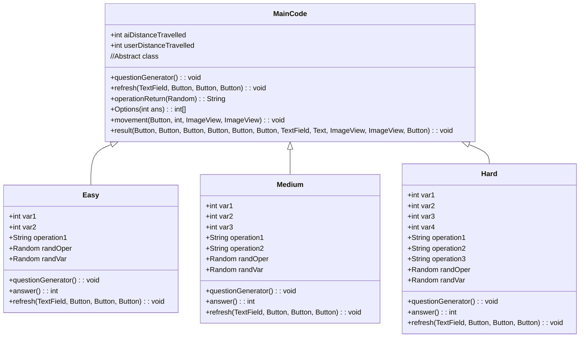

# IMPLEMENTATION MANUAL
## Mathly Motors by AMs&AMs

```mermaid 
classDiagram
MainCode <|-- Easy
MainCode <|-- Medium
MainCode <|-- Hard
class MainCode {
    +int aiDistanceTravelled
    +int userDistanceTravelled
    +questionGenerator() : void
    +refresh(TextField, Button, Button, Button) : void
    +operationReturn (Random): String
    +Options (int ans): int[]
    +movement(Button, int, ImageView, ImageView): void
    +result (Button, Button, Button, Button, Button, Button, TextField, Text, ImageView, ImageView, Button): void
    
    //Abstract class
}
class Easy {
    +int var1
    +int var2
    +String operation1
    +Random randOper
    +Random randVar
    +questionGenerator(): void
    +answer(): int
    +refresh (TextField, Button, Button, Button): void
}
class Medium {
    +int var1
    +int var2
    +int var3
    +String operation1
    +String operation2
    +Random randOper
    +Random randVar
    +questionGenerator(): void
    +answer(): int
    +refresh (TextField, Button, Button, Button): void
}
class Hard {
    +int var1
    +int var2
    +int var3
    +int var4
    +String operation1
    +String operation2
    +String operation3
    +Random randOper
    +Random randVar
    +questionGenerator(): void
    +answer(): int
    +refresh (TextField, Button, Button, Button): void
}


```